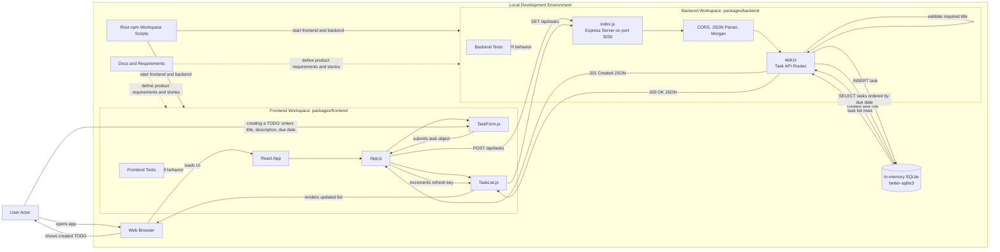

# Cloud Architecture Overview

This repository is a local development monorepo for a Todo application. It contains a React frontend, an Express backend API, an in-memory SQLite database, automated tests, and product documentation. There are no deployed cloud services or external storage components in the current implementation.

## Context Diagram

## Component Notes

- User Actor: A person using the Todo app through a web browser.
- Web Browser: Runs the React application during local development.
- React App: The frontend application served by `react-scripts` from `packages/frontend`.
- `App.js`: Owns edit state, save behavior, and task list refresh behavior.
- `TaskForm.js`: Captures task title, description, and due date, then submits task data for create or update actions.
- `TaskList.js`: Fetches tasks, renders task rows, and supports edit, delete, and completion toggle actions.
- Express Server: Started by `packages/backend/src/index.js` on port `3030` by default.
- Task API Routes: Implemented in `packages/backend/src/app.js`, including create, list, detail, update, complete, and delete endpoints.
- Middleware: Enables CORS, parses JSON request bodies, and logs HTTP requests.
- In-memory SQLite: Stores tasks for the lifetime of the backend process using `better-sqlite3`.
- Root npm Workspace Scripts: Start and test the frontend and backend workspaces from the repository root.
- Tests: Frontend and backend test suites validate UI and API behavior.
- Docs and Requirements: Product requirements, epics, stories, and supporting artifacts guide implementation scope.

## Create TODO Flow

1. The user opens the React app in a browser.
2. The user enters TODO details in `TaskForm.js` and submits the form.
3. `TaskForm.js` passes the task object to `App.js`.
4. `App.js` sends `POST /api/tasks` to the Express backend.
5. `app.js` validates that `title` is present and inserts the task into the in-memory SQLite database.
6. The API returns the created task as JSON with a `201 Created` response.
7. `App.js` refreshes `TaskList.js`.
8. `TaskList.js` requests `GET /api/tasks` and renders the updated TODO list.